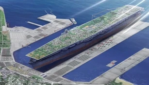
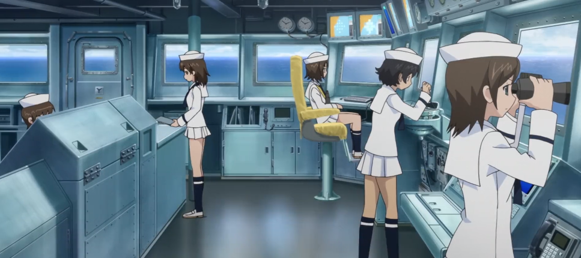
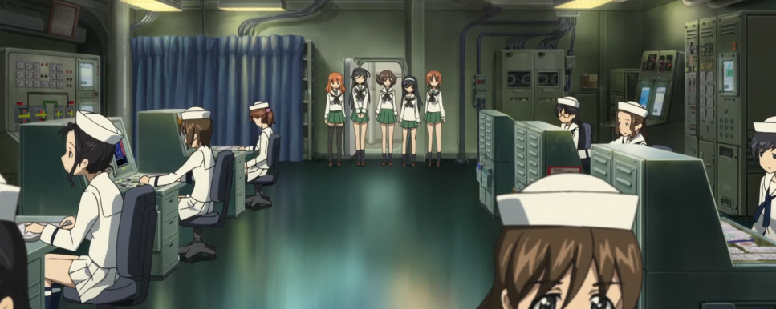
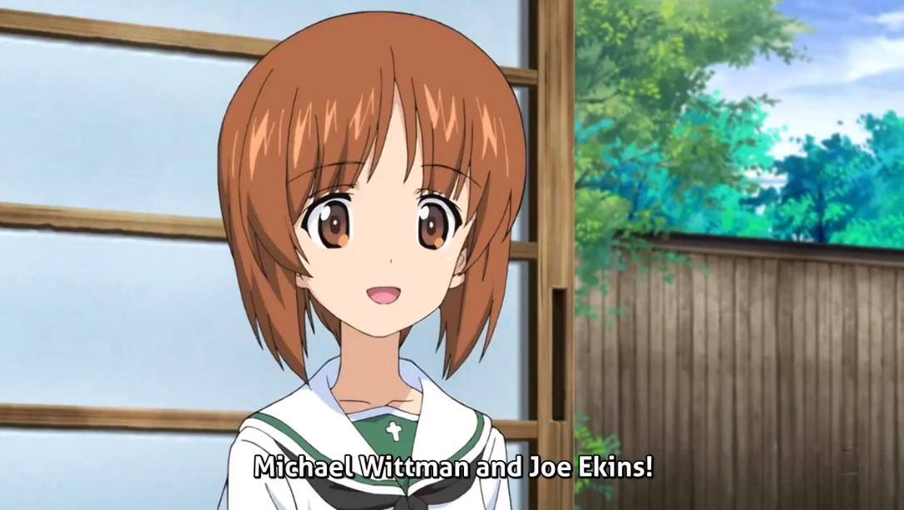

# The Strange and Borderline Horrific Implications of the _Girls Und Panzer_ Lore
_Girls Und Panzer_, an anime releasing in 2012 under the direction of Tsutomu Mizushima, is the sort of beautiful abomination of a show that one might call the pinnacle of the medium's evolution. At its heart, the series (which will, from here on out, be referred to as _GuP_) revolves around middle school girls doing what middle school girls do best: that is, tactically fighting each other for sport. Instead of schools taking pride in their curriculum or, say, their soccer or basketball team, schools in the _GuP_ universe take pride in their brilliant Sensha-dō teams; Sensha-dō, as we all know, is the ancient, girls-only martial art form revolving around the maintenence and utilization of World War I and II era tanks as a vessel for improving your womenhood. _Literal tanks_, by the way - the series isn't one for the subtleties of metaphors, no, these are REAL tanks: the main character and her best friends are fully capable (and actually rather skilled, for the show's standards) of operating and deploying a 1930s German Panzer IV.

 Pictured above is the main character, Miho Nishizumi, along with her friends inside of their Panzer IV, which they've endearingly plastered an anglerfish symbol over - the mark of her team. 

Sensha-dō, as brought up previously, is a pre-WWII sport made for women to improve many attributes: in particular, self-esteem, citizenship, and motherly traits: these are, of course, rather strange traits to reduce an entire women's being to, but the genuine, in universe Sensha-dō propoganda film these blurbs were pulled from was created in 1939, at the peak of the Second World War. I can't delve deep into the fact that genuine war propoganda is being fed to classes fulled of 14-year old girls (and yes, this is a _mandatory_ tape to view for, atleast, the protagonist's school), as, even on the surface, the world of _GuP_ is so comically absurd, and yet so, so beautiful.

And I _do mean_ on the surface, by the way. These "schools" I have been mentioning - the great education system that makes it so that it is easier for students to fire a tank then pass basic algebra - all take place on **aircraft-carrier-esque floating cities**, the size of which are in no way feasible, and are such behemoths that, when docked, tower over the ports meant to house them:

 The main character's school of choice, Oorai Girls' Academy, is on the _smaller_ end of these "school ships". 

These ships are not only massive, but populated: Oorai's Academy alone (which, by the way, is the _entire_ ship) houses over 30,000 people, which is a population that is higher than that of four countries. This 30,000 isn't just comprised of middle-school girls, of course: many (but not all) of the students' families live aboard the ship, as well as the teachers and staff, and the 9 to 5s who work in grocers, convenience stores, ice cream shops, restaraunts, and basically everything else a 14-15 year old girl might need after a tiring day of manuevering a tank for a grade. You might have noticed that there was one key group of people that were _not_ on the list of residents: where do the people who manage the ship live? Don't you fret, my buddy old pal, because they're in that list.

They're the 14-15 year old girls.

## The Labor of a School Ship

For Oorai's Academy (The main character's School Ship), the education system is broken down into factions, with each different sector of education teaching entirely different and seperate things. Those divisions are as follows:
- Standard Education
- Naval Education
- Engineering
- Intelligence
- Fashion Design
- Nutritional Science
- Fisheries Management
- Agricultural Science

There are other divisions mentioned (such as Meterology), but they are not offered by the main character's school. Another thing to note is that these divisions are _mutually_ exclusive: if you're in one division, you will _not_ learn another (with a few exceptions). This means that someone learning, say, how to design clothes for the hottest trends, or how to fish efficiently and effectively, would not learn World History, Languages, or Math, all of which are offered under Standard Education; this pathway is also the one which offers the Sensha-dō sport.

As for those who run the ship, it is those in the Naval Educations, Engineering, and (presumably) the Intelligence divisions: Naval Educations keep the boat running, moving, and in tip-top shape, while Engineering provides power to the entire cities' worth of technology, lighting, and other such fixtures. If this sounds like child labor, that is because it _literally_ is: instead of paying for tuitions, students can opt for taking _these_ divisions instead, working a full 8 hour shift on top of classes, studying, homework, and generally being a 14-15 year old girl. The entire backbone of the ship is literally built off of draining the lives of 15 year old children, and if *that* isn't a perfect example of the education system, well.. This is a school project, so I won't say too much!!

 Naval Studies girls spend nearly their entire day managing and running the ship.. They don't get paid either, too! 

 The girls in Engineering have the exciting job of sitting down all day! Well, there are probably other girls who have to run maintenence on power lines, downed wires, and any other artlliery-related damage... 

There wasn't enough time for depressing anecdotes about the school system, anyways! We need to move on to the broader picture, as there isn't just one School Ship... There's a whole armada, each relating to a different time period or country!

## Countries and Borders in the Confines of a Warship

Now, the nations and nationalities depicted in _GuP_ are rather confusing, as it is never truly made clear if each school's residents are truly citizens of the country the ship's culture borrows or is inspired by - or rather, the culture that the ship stereotypes (but not in any genuine, harmful way). There are several different school ships shown throughout the series, but I'm only going to bring up a select few:

Saint Gloriana Girl's College is a "British" (in quotes for a reason) schoolship, with girls whose Sensha-dō practices include drinking _tea_ while piloting their tanks: after all, a skillful and elegant "Brit" should be able to fight off an entire squadron without spilling even a drop. They pride themselves on being respectful and courteous, and their commanders are _all_ named after a type of tea; Darjeeling, Pekoe, and so on.

Anzio High is more so a comedy act then a full-fledged school: being "Italian" (again in quotes), the girls here pride themselves on fun, joy, and _lots_ of food. Their Sensha-dō team drives small, two-person tanks, as most of the school's budget is spent on extravagent parties, buffets, and _lots_ of food: the school square looks like a festival, with booths all over where students can get some pasta, pizza, or maybe even a nice burger to get ready for the next battle.

*****

These two schools may seem very stereotypical of the countries they represent: and there might even be a reason for that in-universe (here's where those quotes come in). It is _never_ made clear if these schools actually hold any British or Italian population: in fact, there is more evidence to suggest that every single Warship has a majority _Japanese_ population rather than one of their culture. Multiple times throughout the show, the main character refers to different schools as a school that 'is based off of' or 'inspired by' its country's culture: it is never explicitly stated that the girls of the Italian high school are actually Italian. Sure, they may say _some_ Italian words, or English phrases, but, for the most part, these girls are speaking fluent Japanese - which is not, as some may think, just a restriction based on the fact that this is a Japanese anime made for a Japanese audience who speaks and understands Japanese. It is outright stated that the girls _are_, in universe, speaking Japanese: one character, a USSR commander, berates a member of her squad for only speaking in Russian, saying instead to "speak in Japanese!"

The implications of this are rather confusing: what happened to every other nationality? Are they doing the _reasonable_ thing, staying on land, while the Japanese take to the sea and take their culture for themselves? Did some kind of horrific war or battle cause the other nations to be wiped out, leaving only Japan remaining? What happened to everything else? The history of _GuP_ stays accurate to real-world events, save for the few references to schools in-universe taking place on boats since before the death of Christ: characters, at numerous points, make reference to battles such as World War I and II, and even famous commanders of the era, so when's the disconnect? When did this world go so horribly wrong?

 The Main character, Miho Nishizumi, makes a reference to two real-life historical soldiers from the second World War. 

..Wait, forget all that. What did I say two paragraphs ago? Did I just say there was a girl from the _USSR?_

## Pravda High School, and the Unknown State of the USSR

The final piece of _GuP_ lore I'm going to bring up, and honestly one of the silliest unmentioned piece of information, is the political conditions of one specific country (if it even is one anymore): Russia, or what is formerly (in our world) the USSR. As anyone should know, the USSR collapsed - it's gone. In its place is Russia, complete with a different political system, general daily life, and, of course, a different flag.

So why does Pravda, the Russian school ship brandish a parody of the Soviet flag?

 Pravda's commander, Katyusha, sits in front of a banner showcasing her school's flag. 

Now, this isn't the only instance of _GuP_ using a historical political symbol: The German School's logo utilizes the Iron Cross (Without the sw*tstika, I feel the need to mention! At no point does _GuP_ reference or use Nazi symbols! Still, it is a little concerning sometimes..), but, given the fact that the symbol in question is primarily _war_ related, there is no question or implication regarding the political status of Germany _or_ it's school.

However, of course, the hammer and sickle was _the flag_ of the USSR, not just a symbol regarding their military technology. Furthermore, modern-day Russia is never mentioned or reference throughout the entirety of the show - the current Russian flag is not present anywhere - and there are no telltale signs that Pravda as a society is _past_ the Soviet Union. The world and story is clearly set in the modern age: girls play video games that could _not_ have been made later than the year 2000, and general technology and culture is long past the 80s. Even so, Pravda remains seemingly stuck before December of 1991: really, there isn't any sign of Pravda being based off of _modern_ Russia! All references to Russia are broad and general: snow-based combat and the language itself. It really is a possibility that, in the world of _Girl's und Panzer_, the Soviet Union is very much a current world power! Maybe _that's_ what happened to the other nations...

So, what did we learn? Not much, really - just that _Girls und Panzer_ is a genuinely insane show with lore so complex, yet so surface-level that it makes me want to tear my hair out. However, despite all that, it really is a good show and a recommended watch to anyone interested in the sports anime genre (and someone who is familiar with anime in general; this is **not** a good starter show). If anyone really _does_ watch _Girls und Panzer_ because of this website, I am so, _so_ sorry. It really isn't all that, I'm just a bit fixated on it right now.. But, still! Girls driving tanks with queer undertones! This is my desperate plea!  please.. it's really bad but it's also really funny... the girls are dating and they're so cute, please...  
\*sniff* look, i'll even give you an easy way to watch it, too.. Just.. Just [click right here to be taken to HiDive's website](https://www.hidive.com/tv/girls-und-panzer) and make an account or something.. Don't pirate the show.. You can watch it right there right now..  thank you goodbye........ 

*****

### Sources..?

All imagery used are screenshots taken from the _Girls und Panzer_ anime, the first film, _Girls und Panzer Der Film_, and the 3rd episode of the OVA, "School Ship War!" All references and lore come from the series itself, as well as the 3rd OVA episode. Girls und Panzer was beautifully crafted by the folks over at Actas Studio, and if Sentai Filmworks (or anyone else related to the _Girls und Panzer_ project, entity or otherwise) wishes for this website to go down, I will gladly do so! Thank you for making _Girls und Panzer!_ I hope the upcoming movies are worth the wait. Panzer Vor!  
  
****
